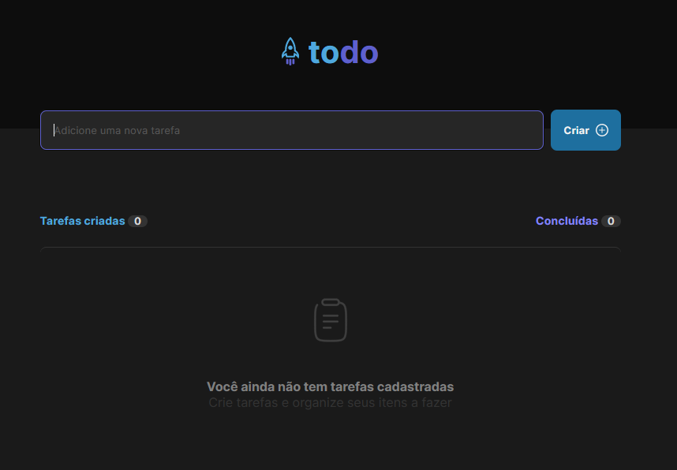
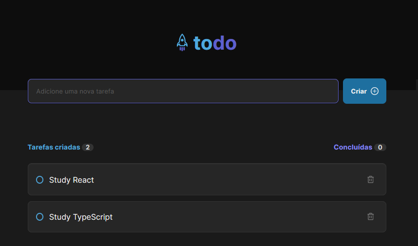

# Rocketseat - Todo list challenge

This is a solution to the first challenge proposed by Rocketseat Ignite React path.

## Table of contents

- [Rocketseat - Todo list challenge](#rocketseat---todo-list-challenge)
  - [Table of contents](#table-of-contents)
  - [Overview](#overview)
    - [The challenge](#the-challenge)
    - [Screenshot](#screenshot)
    - [Links](#links)
  - [My process](#my-process)
    - [Built with](#built-with)
    - [What I learned](#what-i-learned)
  - [Author](#author)

## Overview

### The challenge

Users should be able to:

- Create a new todo
- Check and uncheck todo as done.
- Remove todo from list
- Show progress on todo conclusion.

### Screenshot

  
Click to view the screenshot

### Links

- Live Site URL: [See it on Vercel!](https://ignite-reactjs-todolist-bice.vercel.app/)

## My process

### Built with

- Semantic HTML5 markup
- CSS custom properties
- Flexbox
- CSS Grid
- Mobile-first workflow
- [React](https://reactjs.org/)

### What I learned

I learned how to manage states and pass states as props to components.

TypeScript was a huge challenge on this one because of the way it works around forms.

## Author

- Frontend Mentor - [@acamposlucas](https://www.frontendmentor.io/profile/acamposlucas)
- Twitter - [@almeidaclucas](https://www.twitter.com/almeidaclucas)
